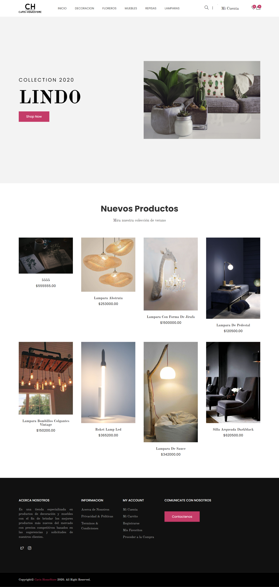
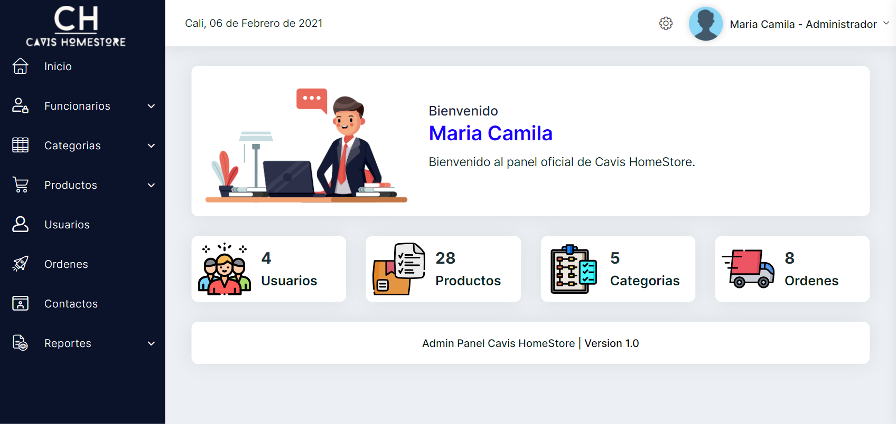

# E-Commerce CAVIS HomeStore

Desarrollo de e-commerce web creado con PHP, JavaScript, CSS, HTML 

Cuenta con un portal inicial que le da la bienvenida al usuario interesado en los productos, con la caracteristica de permitir a usuarios ya registrados, realizar compras, ver historial de las mismas, actualizar su perfil y los estados de su orden, ademas de añadir a una lista de deseos.

## Pagina inicial

-> Productos cargados de manera dinamica desde la base de datos

## Panel del Administrador

-> CRUD dependiente de las siguiente secciones:
  -Funcionarios
  -Categorias
  -Productos
  -Usuarios
  -Ordenes (Indicando estado de orden)
  
-> Seccion de reportes

